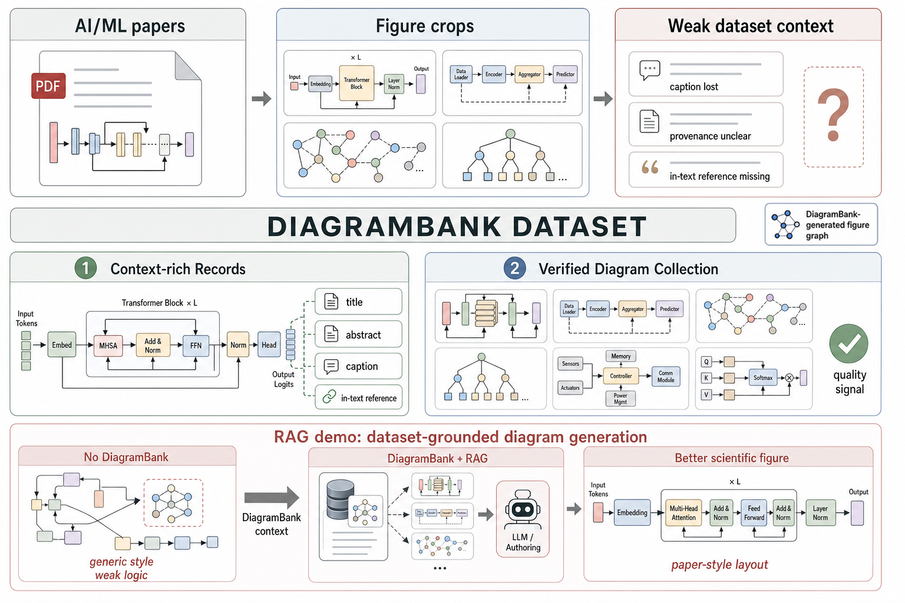

# DiagramBank

**DiagramBank: A Quality-Audited Dataset of Scientific Schematic Diagrams with Multi-Level Document Context.**

DiagramBank is a large-scale, retrieval-ready collection of scientific schematic diagrams mined from top-tier AI/ML publications, paired with rich paper metadata and figure-local context. The primary release contains **57,100 cascade-filtered diagrams** and is designed to support diagram retrieval, exemplar-driven scientific figure authoring, and broader multimodal research beyond generation.

---

## Overview



---

## Motivation

Autonomous “AI scientist” pipelines can draft text and code, but producing a publication-grade teaser/overview diagram is still a major bottleneck. Unlike routine data plots, a good scientific diagram requires conceptual synthesis, layout planning, consistent topology (arrows/relations), and readable annotations.

DiagramBank addresses this gap by providing a large bank of real, high-quality diagram exemplars with multiple levels of grounding text (paper title/abstract, figure caption, and in-text reference spans) so you can retrieve relevant designs at different granularities and use them for retrieval-augmented authoring.

---

## What’s in DiagramBank

Each diagram record is enriched with both **figure-level** and **paper-level** information. Depending on availability, metadata can include:

- Diagram image + caption
- Figure context: paragraphs that cite the figure in the paper body (how authors explain the figure)
- Paper title + abstract (paper intent / domain)
- Additional OpenReview metadata such as decision status, reviewer scores, keywords/subject areas, URLs, BibTeX, etc.
- CLIP label/confidence fields and cascade verification fields (to support controllable filtering)

The Hugging Face release provides the core retrieval artifacts (e.g., `data.jsonl`, FAISS indices, and DuckDB) so you can get started quickly without storing large files in this GitHub repo.

### Release snapshot

- Primary release: **57,100** cascade-filtered schematic diagrams
- Venue counts: ICLR 20,516; ICML 11,267; NeurIPS 19,655; TMLR 5,662
- Cascade paths: `t1_unanimous` 46,524; `t1_majority` 3,645; `t1_minority_gpt_tiebreak` 1,865; `t2_vlm_consensus_gpt_confirmed` 5,066
- Quality estimate: 93.67% precision with 95% CI [90.11%, 97.22%]

See [relations.md](relations.md) for the full `data.jsonl` schema, including `clip_type`, `clip_confidence`, `label_cascade`, and `cascade_path`.

---

## Example use cases

DiagramBank is intentionally broader than “diagram generation”:

### Retrieval-augmented diagram authoring (RAG)
- Retrieve exemplar diagrams similar to your paper’s **title/abstract/caption**
- Use retrieved exemplars to guide layout, style, grouping, iconography, and composition for teaser-style figures

### Multimodal retrieval and benchmarking
- Build and evaluate retrieval systems that operate on diagram-centric scientific content
- Explore coarse-to-fine retrieval (paper-level → figure-level)

### Diagram understanding / classification / clustering
- Train or evaluate figure-type classifiers, diagram style classifiers, topic/style clustering, etc.
- Study diagram conventions across venues/years

### Paper-level analytics & scientometrics with visual signals
Because records are linked to paper metadata, you can explore questions like:
- How do diagram properties correlate with acceptance decisions, review scores, or venue/year?
- How does diagram density or caption verbosity evolve over time?
- What diagram styles dominate specific subject areas?

### Context-aware tasks
Figure context spans enable tasks that require more than captions:
- Context-aware diagram retrieval
- Diagram-to-text alignment and grounding
- Studying how authors narrate and operationalize diagrams in scientific writing

---

## Prerequisites

### conda
```bash
conda env create --file environment.yml
````

---

## Download the DiagramBank dataset

### 1) Set the target folder

The default download is large. Make sure you have enough disk space.

```bash
# Run it (downloads accepted-paper image archives plus core files)
# Set the target folder using the FIG_RAG_DIR environment variable
export FIG_RAG_DIR=<a scratch folder with enough disk space>
```

### 2) Download options

```bash
# 1. Default: Download accepted-paper images + core files (data.jsonl/FAISS/DBs)
python huggingface/download_diagrambank.py

# 2. Download Everything: All papers (Accept + Reject) + Core files
# python huggingface/download_diagrambank.py --subset all

# 3. Download Rejected papers only + Core files
# python huggingface/download_diagrambank.py --subset reject

# 4. Skip Core Files: Download only images (no DBs or FAISS)
# python huggingface/download_diagrambank.py --no-core

# 5. Combine Flags: Download all images but skip core files
# python huggingface/download_diagrambank.py --subset all --no-core

# 6. Download only raw reproduction metadata archives for ICLR/ICML
# python huggingface/download_diagrambank.py --metadata-only

# 7. Include raw reproduction metadata archives with the selected image subset
# python huggingface/download_diagrambank.py --metadata
```

The script will download `data.jsonl` and automatically extract the diagram folder, FAISS index, and DuckDB database to `$FIG_RAG_DIR`. Add `--metadata` to also download raw ICLR/ICML reproduction metadata archives. The process can take 15–30 minutes depending on network speed.

---

## Check installation

```bash
du -sh $FIG_RAG_DIR
51G 
```

```bash
tree -L 4 $FIG_RAG_DIR

├── data.jsonl
├── faiss
│   ├── abstract_index
│   │   ├── index.faiss
│   │   └── index.pkl
│   ├── caption_index
│   │   ├── index.faiss
│   │   └── index.pkl
│   ├── research.db
│   └── title_index
│       ├── index.faiss
│       └── index.pkl
└── OpenReview
    ├── ICLR
    │   ├── figures
    │   │   ├── 2017
    │   │   ├── 2018
    │   │   ├── 2019
    │   │   ├── 2020
    │   │   ├── 2021
    │   │   ├── 2022
    │   │   ├── 2023
    │   │   ├── 2024
    │   │   ├── 2025
    │   │   └── 2026
    │   └── research.db
    ├── ICML
    │   ├── figures
    │   │   ├── 2023
    │   │   ├── 2024
    │   │   └── 2025
    │   └── research.db
    ├── NeurIPS
    │   ├── figures
    │   │   ├── 2021
    │   │   ├── 2022
    │   │   ├── 2024
    │   │   └── 2025
    │   └── research.db
    └── TMLR
        ├── figures
        │   ├── 2022
        │   ├── 2023
        │   ├── 2024
        │   ├── 2025
        │   └── 2026
        └── research.db
```

### What are these indices?

* `title_index`: coarse paper-level filtering (topic/domain alignment)
* `abstract_index`: paper-level refinement (problem/method alignment)
* `caption_index`: figure-level matching (diagram content alignment)

---

## Usage

### Set your OpenAI API key

```bash
export OPENAI_API_KEY=<your openai api key>
```

This is only used for embedding the *query text* at runtime, so the cost is very low ($0.13/1M tokens with Text Embedding 3 Large) ([https://costgoat.com/pricing/openai-embeddings](https://costgoat.com/pricing/openai-embeddings)) A paper title is 5-25 words, an abstract is 150-250 words, and a caption is 10-100 words. Take an upper bound of 500 words, and 1.33 tokens per word, yielding an upper bound of 1000 token per query. Then, for 1000 queries, the cost will be $0.13.

> Note: pricing can change; treat the above as a back-of-the-envelope estimate.

### Retrieve similar diagrams for your figure

To retrieve the similar diagrams for your figures, go to [demo/query-diagram.ipynb](demo/query-diagrams.ipynb). Set `title`, `abstract`, and `caption` for your paper, and then keep running the fourth cell to get the similar diagrams.

- `t1`: number of diagrams with similar title
- `t2`: number of diagrams with similar abstract
- `k`: number of diagrams with similar caption

`hierarchical_retrieval()` will retrieve the top-`k` similar diagrams based on your title, abstract, and caption.

---

## Hugging Face

The dataset and model card is hosted at:
[https://huggingface.co/datasets/ghzlmc/DiagramBank](https://huggingface.co/datasets/ghzlmc/DiagramBank)

---

## Reproduce this work

If you want to reproduce this work, see [reproduce/README.md](reproduce/README.md). Might take a few days up to a week.

The scripts under `reproduce/` cover raw OpenReview collection, PDF figure extraction, context extraction, and first-stage CLIP classification. The primary release is the cascade-filtered 57,100-record dataset hosted on Hugging Face as `data.jsonl`; [faiss/join_data.py](faiss/join_data.py) validates the downloaded release artifacts.

---

## Notes on responsible use

* DiagramBank is mined from publicly accessible scientific PDFs and includes metadata for attribution and traceability.
* Figures may be subject to the original authors’/publishers’ licenses and terms. Please use responsibly and cite the relevant sources.
* If you use DiagramBank for generative authoring, we recommend provenance tracking and disclosure for AI-generated figures where appropriate.

---

## Citation

If you use DiagramBank in your research, please cite our paper (and consider citing the original papers for any retrieved exemplars you use directly).

```bibtex
@article{yue2026diagrambank,
  title={DiagramBank: A Quality-Audited Dataset of Scientific Schematic Diagrams with Multi-Level Document Context},
  author={Yue, Ling and Zhang, Tingwen and Jiaying Wang and Xu, Zhen and Pan, Shaowu},
  journal={arXiv preprint arXiv:2604.20857},
  year={2026}
}
```

